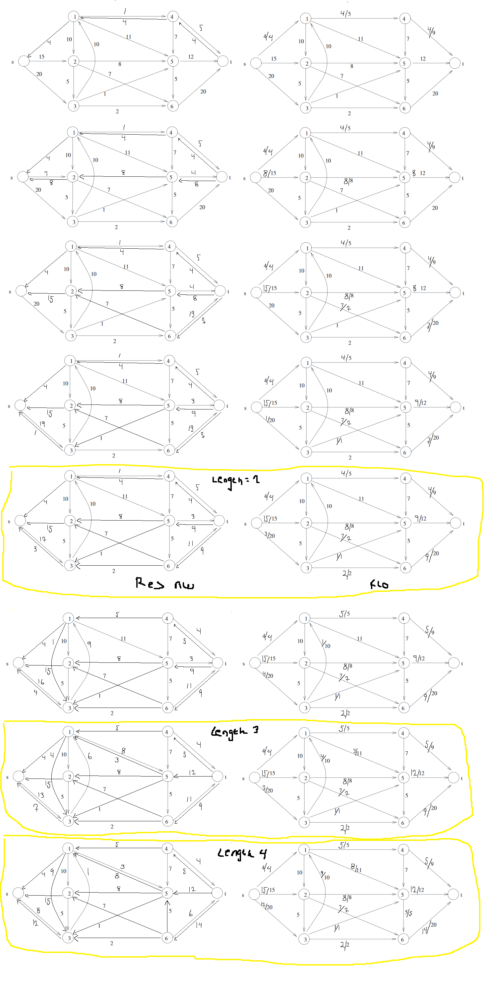
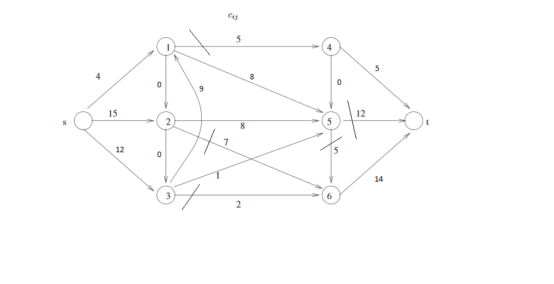
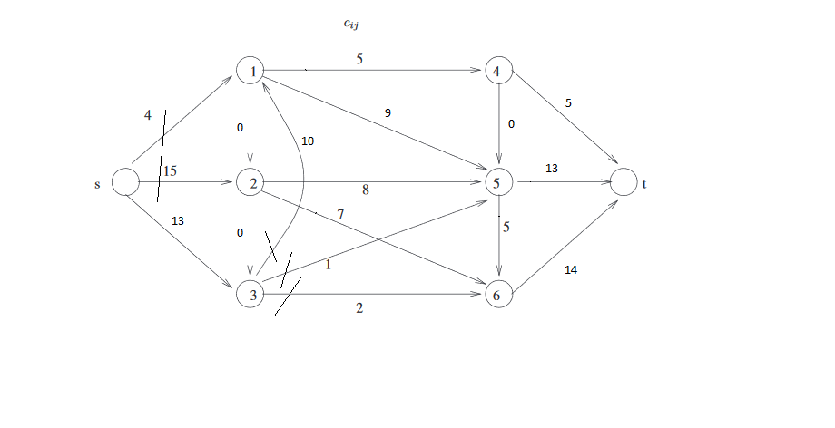

### 1

a)  
We have n different coupons, and we pick 2 of those each time. The probability of getting 1 new coupon is (n-i)/n. But since we only make progress if we get 2 new coupons, the probability of making progress, hence having i+2 coupons after the next step, will, assuming we always collect two different coupons be:

```((n-i)/n) * (n-(i+1))/n```


b)  
If we let X be the random variable equal to the number of steps we have to spend in a phase j, before moving on to phase j+1, then  
we suppose ```E[X_j] = (nC2)/(n-1C2)```  
For each step j, the phase only ends if the first coupon is new, and the second coupon is new, hence they are both one of the n-1 for each pick. In phase j, we know that we are waiting for an event of probability  
p = ```((n-i)/n) * (n-(i+1))/n```  
This means that, the probability of not making progress is 1 - p.  
We let Z denote the random variable equal to the number of attempts in order to make progress.  
For k > 0,
**Pr[Z = k] = (1 - p)^(k - 1)*p**, because the first k - 1 attempts to collect new coupons needs to be coupons that are already collected, and the kth needs to be new, therefore
```  
E[Z] = SUM(k=0, inf)k*Pr[X=k] =  
SUM(k=1,inf)k*(1-p)^(k-1)*p =   
p/1-p*SUM(k=1, inf)k*(1-p)^(k) =  
p/1-p * (1-p)/p^2 =
(((n-i)/n) * (n-(i+1))/n) /  
(1- ((n-i)/n) * (n-(i+1))/n) *
(1- ((n-i)/n) * (n-(i+1))/n) /
(((n-i)/n) * (n-(i+1))/n)^(2) =
1/((n-i)/n) * (n-(i+1))/n =  
```
**1/p** = (nC2)/(n-1C2)

c)
Let R be a random variable that indicates number of trials until success.


***


### 2

a)  
We want to find the expected number R of clauses that is satisifed on m clauses, this time for k >= 3.  
Again we suppose we set each variable x1, ..., xn indepedently to 0 or 1 with probability 1/2.  
We let m denote the number of clauses C_1, ... C_m.
We let **Z** denote the random variable equal to the number of satisfied clauses.    
R_i = 1 if clause C_i is satisfied, otherwise 0  
This means that,  
```Z = Z_1 + Z_2 ... + Z_m.```  
E[Z_i] is equal to the probability that C_i is satisifed.  
For C_i not to be satisifed, each of C_i's k variables must have the value that does not make the clause true.  
The probability of this is  ```(1/2)^k```, because the variables are set independetly.  
This means that, clause C_i is satisfied with probability   
```E[Z_i] = 1 - (1/2)^k```.  
By linearity of expectation,  
```R = E[Z_1] + E[Z_2] + ... + E[Z_m] = (1-(1/2)^k)*m```

b)  
Above it is shown that a random truth assignment satisfies 1-(1/2)^k of the clauses for every instance of k-SAT, so this means there must exist a truth assignment that satisfies at least R clauses.


c)  
A Las Vegas algorithm A that will find a truth assignment that makes at least R of the clauses in F true, could for example for every variable x_1, x_2, ..., x_n in the formula, pick randomly a variable and switch it to its negation. It should keep doing this until atleast R of the clauses are true.


d)  
For j = 0,1,2 ..., m, let p_j denote the probability that exactly j clauses are satisifed by a random assignment.  
This is equal to  
```SUM(j=0, m)jp_j```, and this is equal to **R**.  
We want the quantity p = ```SUM(j>=(1-(1/2^k)*m))p_j```


***


### 3

a)  
```py
def randperm(S):
    if p > 0:
        X_1 = A(S)
        X_2 = {}
        for i in S:
            if i not in X_1:
                X_2.append(i)
        randperm(X_1)
        randperm(X_2)
        return X_1 ++ X_2
    if p == 0:
        return S[0]
```


b)  
First we need a base case, suppose the scenario for **k = 1**    
This means the size of S will be 2^1, so p = 1.  
When we enter RANDPERM the algorithm will recognize p > 0, because p = 1.  
It will call A on the given set S and generate a random subset X_1 of size 2^p-1, in this case 2^0, which will give us a subset X_1 with 1 element. X_2 will be the remaining element, that is not in X_1.  
X_1 and X_2 will be returned with 1 element in each. Example input could be {a,b} with outcome {b, a} where b is the random permutation X_1 of S, and a is the random permutation X_2 of S.  

Now we assume the same for k = **k+1.**  
The size of S is 2^k, so p = **k.**  
RANDPERM will again recognize p > 0, because p = k  
A will give us a random subset X_1 of S of size 2^k-1, and X_2 will be the remaining elements in S, that are not in X_1.
Finally we will return subset X_1 and X_2, both of size 2^k-1.

Should the size of the set S be 1, it will mean that we have a set size of 2^0, because 2^0 = 1, which means we will return the only element in the set, because p = k = 0.

We will assume that the algorithm works correctly for all k > 0.


c)  
If we were to implement A, we would simply pick r random elements from a set S. However, each time we pick an element, we would have to make sure, that the newly picked element, has not already been picked, else we would end up with duplicates in the returned subset. Elements are appended to the new subset as they are picked, given that they are of course not picked already.  
We should keep some kind of tracker, very suitingly r, which should be decremented everytime we append an element to the subset.     
The process of picking the elements could be done in a while loop, which would not break until r = 0.
Once r elements have been picked with no duplicates, we will check if the subset of the currently r picked elements has length S/2.  
The reason why A will always return a subset of size S/2, is because we suppose that A always takes sets containing 2r elements. So, if we pick r elements, A will return **S/2 = r elements**, because S/2 is always the value of r.

As an example, suppose we have S = {"a","b","c","d","e","f"}. The size of S = 6 = 2*3, which means that r = 3. A will randomly pick 3 elements one by one, as long as r > 0 and decrement the value of r by 1, each time it appends an element to the subset we wish to generate. First it picks "c", checks if "c" is already in the subset, and appends. Then it could pick "d", and then "a". The loop will break, because r = 0, giving us the subset subsetS = {"c","d","a"} and we return. Should we instead of "d" have picked "c" again, the algorithm would not decrement r, and instead pick a new element from S, and repeat.
We will not care about inputs with uneven amounts of elements, but we could throw some kind of exception, if this would be the case.


***


### 4

a)  
Each ball has 1/m chance of ending up in any given box, and the probability wont change based on the outcome of the other balls.
The expected number of balls in a fixed box i is
```n*(1/m)``` = ```n/m``` = ```m^2/m``` = ```m```


b)  
As previously calculated, our expected number of balls = m, therefore a variance of 50% = m/2. Denote X as the random variable representing number of balls in box i.
So,  
P(2m < X < m/2)
If our variance is m/2, this means our standard deviation is ```sqrt(m/2)```  
This means that,  
k = 2m - m / sqrt(m/2)  
The probability that the number of balls in box i will be between 50% of its expected value is therefore (1-(1/k^2)   
Hence, the probability that the number of balls in box i will be more than 50% away from its expected value is,  
```1-(1-(1/k^2)) = 1-(1-(1/sqrt(m/2)))```


https://www.slader.com/textbook/9781259676512-discrete-mathematics-and-its-applications-8th-edition/519/exercises/38/#


c)


d)


e)


***


### 5

a)  
In order to find the maximum flow using the Edmonds-Karp algorithm, we will have to find the bottleneck values. This is done by finding every augmenting path from ```s -> t``` using Breadth-First Search (BFS).  
When no more augmenting paths are left, we can sum the bottleneck values to see the max flow. Also this can be verified by summing the capacity values going into the sink **t**.

For this exercise, we will find every path with length 2,3 ..n until we have no more possible paths.
We will be adding each possible vertice with ```capacity > 0``` from **s** towards **t**, continuing until there are no more possible vertices and we reach the sink **t**.  
```
length 2 shortest paths:
path  |  augmentation
s14t  |  4  
s25t  |  8
s26t  |  7
s35t  |  1
s36t  |  2

length 3 shortest paths:
s314t  |  1
s315t  |  3

length 4 shortest paths:
s3156t  |  5
```



We stop finding augmenting paths, because are no more possible augmenting paths from s -> t.

We can now see that, our max flow ```f*``` is  
```12 + 15 + 4 = 31```


b)  
First we find the set of reachable vertices from the source:
Set of reachables **R_v** vertices = {3, 1, 2, 5, t}.
Now we can find the all the minimum cut arcs, which are the arcs that are from a reachable vertex to a non reachable vertex. Such arcs are: A(3,6) = 2, A(1,4) = 5, A(2,6) = 7, A(5,6) = 5, A(5,t) = 12. We make the cuts.  



This means that our minimum cut capacity is
```2 + 5 + 7 + 5 + 12 = 31 = f*```

c)  
Using our final residual graph, we can see that we will get the maximum flow ```4 + 15 + 13 = 32``` because we will be able to augment path ```s315t``` by 1. This means that vertices 1,2 and 5 will no longer be reachable, and we cut:



Our new minimum cut capacity therefore is:
```4 + 15 + 2 + 1 + 10 = 32```, which is similar to the max flow.


***
